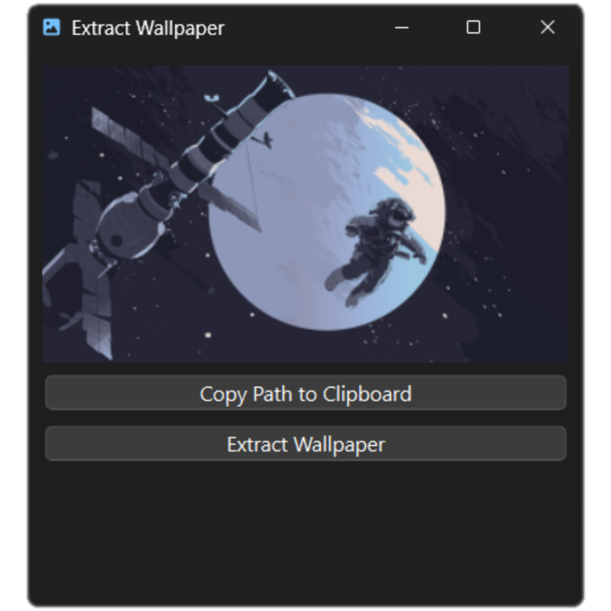

<h1 align="center">
     Wallpaper Extractor
</h1>

A simple (for now) program that obtains the currently-used wallpaper in Windows.

## Features I have in mind

These features are not guaranteed to be released or implemented due to its complexity or niche use.

However, any pull requests that implements one of these is welcomed.

* MacOS and Linux support  
I don't use desktop Linux. Besides, Linux has multiple different desktop environments that store the wallpaper in different path, or have different way of obtaining the current path.  
I have no idea about how it works in MacOS nor do I have one (too expensive 💸).

* Animated wallpaper (e.g Wallpaper Engine, Lively Wallpaper)  
I don't use any of these either because my laptop's battery drains kinda fast. Besides, Wallpaper Engine seems to use PKG/TEX format which needs to be reverse-engineered. You can use notscuffed's [repkg](https://github.com/notscuffed/repkg) for that or do a pull request if you implemented one.  
I have no idea how Lively Wallpaper works.

## Credits

* Font Awesome - app icon
* orangci - Catppuccin Mocha wallpaper collections
* ??? - EndeavourOS Space wallpaper (let me know the original artist name)
